# Figure source — Failure-salvage spiral

```mermaid
flowchart LR
    H0["Hypothesis H0"] --> T0["Frozen test"]
    T0 --> F0["FAIL"]
    F0 --> A0["Retain code + data + verdict"]
    A0 --> D1["Later diagnostic readout"]
    D1 --> H1["Redesigned H1"]
    H1 --> T1["New frozen test"]
    T1 --> F1["FAIL / limit"]
    F1 --> A1["Retain again"]
    A1 --> P["Conceptual pivot"]
    P --> H2["New representation H2"]
    H2 --> T2["Fresh prospective test"]
    T2 --> V2["PASS or new localized FAIL"]

    F0 -. "verdict unchanged" .-> A0
    F1 -. "verdict unchanged" .-> A1
```

## Caption draft

**Figure 2. Failure-salvage spiral.**  
Historical failures are not reclassified as successes. They remain fixed outcomes while their retained data and diagnostics may later influence a new hypothesis. If old data participate in redesign, they are discovery data; claim-bearing support for the replacement hypothesis must come from a new frozen or held-out evaluation.
