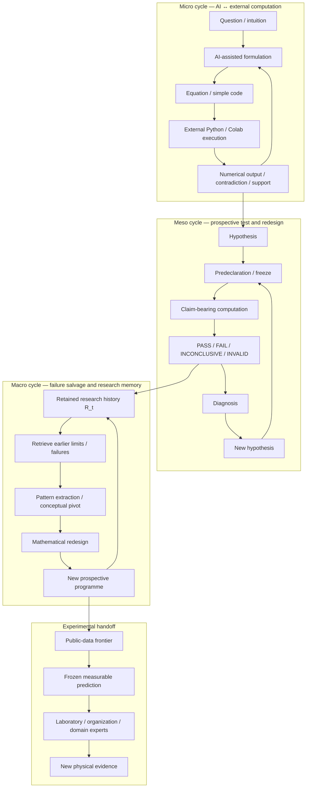

# Figure source — Three nested cycles

This Mermaid diagram is the source for the paper's core architecture figure.

## Caption draft

**Figure 1. Nested architecture of failure-preserving AI-assisted research.**  
At the micro scale, AI-assisted reasoning is repeatedly exposed to externally executed numerical computation. At the meso scale, hypotheses are prospectively frozen and assigned persistent verdicts before redesign. At the macro scale, the retained archive becomes a research-memory state from which earlier negative or limiting outcomes can be retrieved as discovery data. Experimental handoff marks the boundary at which decisive evidence requires new physical measurements.
