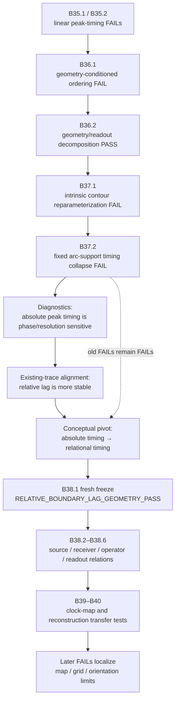

# Figure source — Relational-time pivot in the BIG case study

## Caption draft

**Figure 5. Representational salvage in the later BIG timing programme.**  
Repeated negative or fragile absolute-timing results were retained rather than erased. Their diagnostics contributed to a change of observable toward relative and relational timing. The old data therefore served as discovery material, while the later relational claims were evaluated in newly frozen prospective tests. Subsequent FAILs remained present but increasingly localized transfer, discretization, and reconstruction limits rather than retroactively changing the earlier verdicts.
