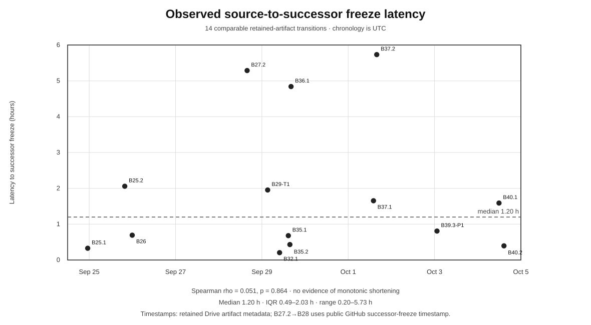

# Supplementary figure — Failure-reuse latency

**Caption.** Fourteen source-to-successor transitions for which retained artifact timestamps permit a reasonably comparable interval from a source result/final status to a separately frozen successor protocol or programme architecture. The median interval is 1.20 h (IQR 0.49–2.03 h). No monotonic shortening is detected across the observed dates (Spearman rho=0.051, p=0.864). These intervals are provenance timestamps, not direct measurements of human or AI reasoning time.

Source data: `evidence/failure_reuse_latency_v0_1.csv`. Private Drive URLs and file IDs are intentionally not published.
