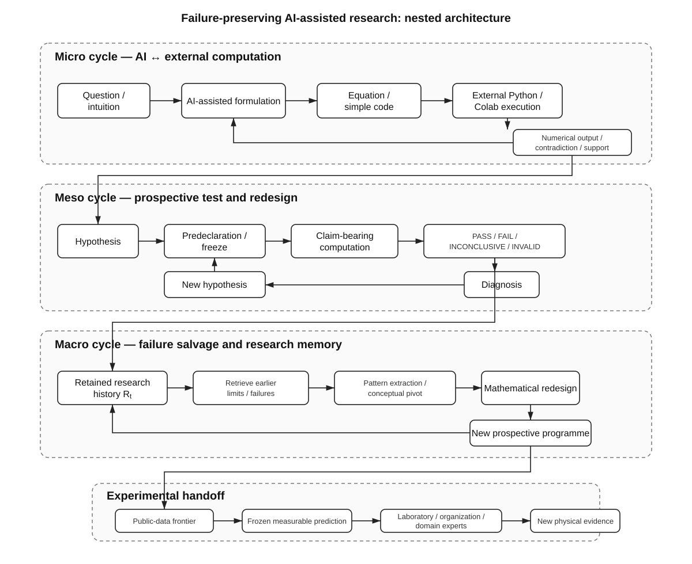
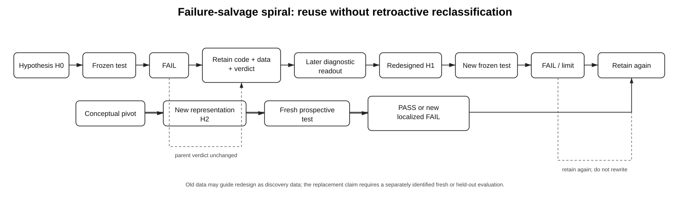
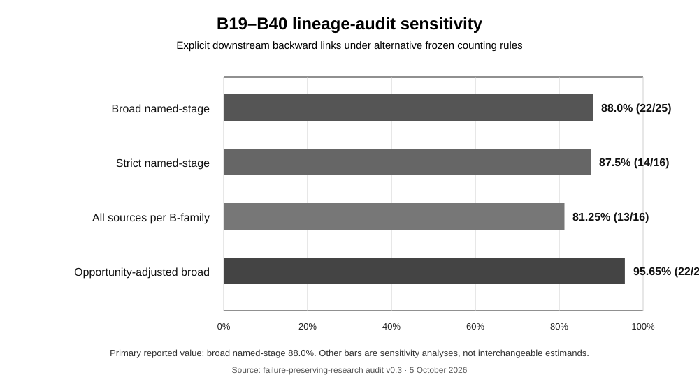
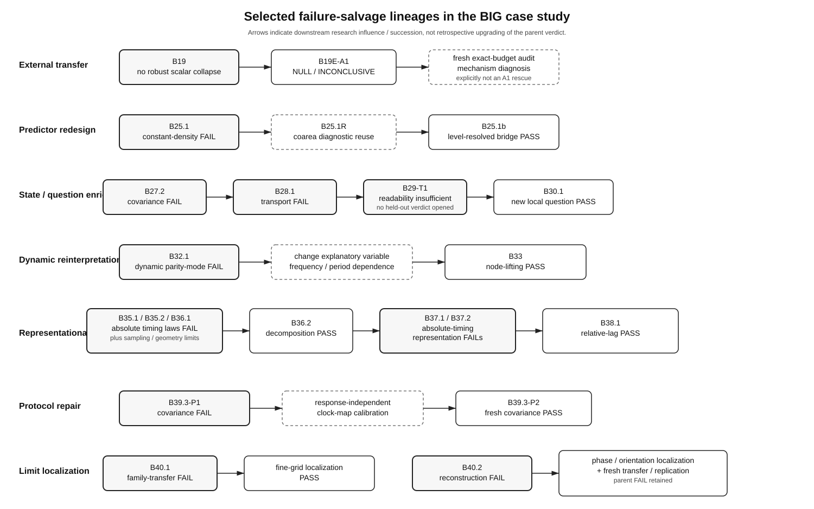
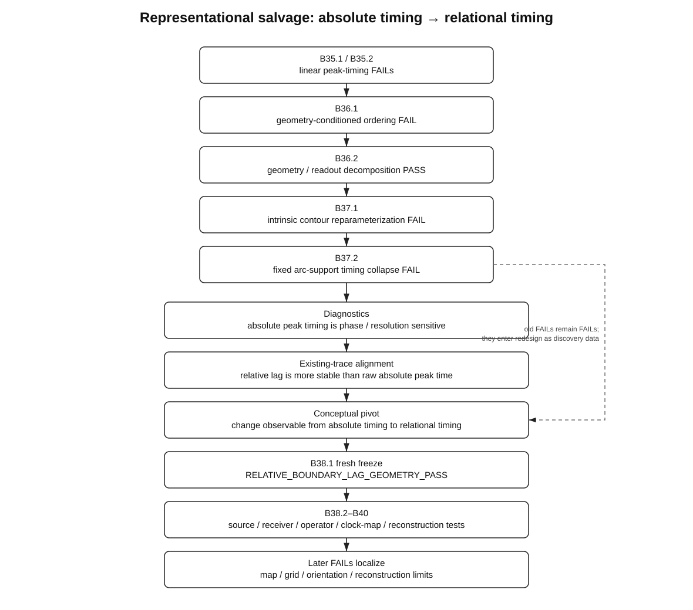

# 失敗保存型AI支援研究

## 個人計算科学のための入れ子型研究アーキテクチャ

### 境界情報幾何学からの縦断的ケーススタディ

**Jun Lucis**  
独立研究者

**日本語参考翻訳版 — 英語原稿 v1.0 release candidate 2 に対応 — 2026年10月6日**

**DOI:** 10.5281/zenodo.23171698

> **翻訳上の位置づけ**  
> 本文書は英語原稿 `paper/manuscript_v1_0_rc2.md` の日本語参考翻訳である。科学的主張、数値、判定語、引用、監査上の意味について英語版と差異が生じた場合は、英語版を正文とする。PASS / FAIL / INCONCLUSIVE / INVALID などの正式判定文字列、および各B-seriesの固有 verdict 名は原文のまま保持する。

---

## 要旨

近年の推論能力を備えたAIシステムは、一人の研究者が実行できる数理的定式化、コード生成、デバッグ、パラメータ探索、比較、文書化の量を大幅に拡張し得る。その方法論的帰結は、単なる高速化より深い可能性がある。探索的計算を生成する費用が下がり、失敗した計算も体系的に保存されるならば、失敗が将来持ち得る期待価値そのものが変化し得る。

本論文は、個人による長期的な計算研究プログラムから形成された、**失敗保存型研究アーキテクチャ**を提案する。このアーキテクチャは三つの入れ子型サイクルからなる。ミクロスケールでは、AI支援による推論と外部で実行される数値計算を交互に行い、方程式や解釈を、会話内の推論ループそのものが生成したのではない計算出力に繰り返しさらす。メソスケールでは、仮説を前向きに凍結し、評価し、PASS、FAIL、INCONCLUSIVE、INVALID などの判定を履歴として保持し、変更する場合には別名の再設計として扱う。マクロスケールでは、失敗、限定的結果、成功を含む実験履歴全体が研究記憶状態となり、後に再読され、新しい仮説への制約や概念変更に利用される。第四の要素である**実験ハンドオフ**は、公開データとシミュレーションだけでは十分でなく、新たな測定に研究室、組織、装置、専門知識が必要となる境界を示す。

Boundary Information Geometry（BIG／境界情報幾何学）は、この研究プロセスのケーススタディとして用いられるのであって、本方法論の前提ではない。現在標準化されているB19–B40のコーディングでは、負または制約的なsource stageが25件同定され、そのうち22件に後続研究への明示的なbackward linkがあった。この88%という値は、コーディングされた当該研究区間についての記述統計としてのみ扱う。以前の監査版では84%であったが、この差は判定規則を変更したためではなく、B29-T1からB30へのsource-backed lineage edgeを一件回収したためである。別の時間監査では、後期のコーディング区間でbackward linkの観測頻度が高かった（12/12 対 10/13）ものの、統計的に説得的な増加は確認されなかった。また比較可能な14件のartifact timestamp遷移では、source resultからsuccessor freezeまでの中央値は約1.20時間であり、時間とともに短縮した証拠は得られなかった。複数の記録済み系列では、負の結果が遡及的に再分類されることなく、後のモデル再設計に寄与している。特に明瞭な例として、constant-density boundary-functional transfer のFAILがあり、その保存profileが後のretrospective coarea analysisを動機づけ、level-resolved predictorが新たに凍結され、fresh held-out casesで前向きに検査された。さらに後期のtiming系列では、absolute timing量の反復的失敗と数値的不安定性が、relative / relational observableへの表現転換を促し、その後に新たに凍結された前向き検査が続いた。

本論文は、AIが科学的誤りを除去するとも、すべての失敗が価値を持つとも、個人による計算研究が実験科学を置き換えるとも主張しない。より限定された提案は、AI支援研究が個人の研究帯域を拡張し得る一方、規律ある失敗保存によって探索履歴の一部を再利用可能な科学資産へ変換し得る、というものである。

---

## 1. はじめに

研究活動の大部分は、最終論文では通常見えなくなる。うまくいかなかったパラメータ化、放棄された観測量、数値的に無効だった実験、明確に失敗した仮説、中間的な診断計算などは、短い方法説明へ圧縮されるか、完全に省略されることが多い。

この圧縮には合理性がある。研究時間は高価である。組織化された科学では、一つの計算分枝が失敗すれば、給与、共有された注意、計算資源、締切、説明コストを消費する。したがって合理的な研究グループには、探索を制限し、有用な結果を生む見込みのある経路へ資源を集中する誘因がある。

個人研究には逆の非対称性がある。個人研究者は、成功確率が低い経路を追う自由を比較的大きく持ち得る一方、歴史的には、大規模な数値研究プログラムを実装し、デバッグし、走査し、点検し、文書化し、改訂するための人的帯域を欠いていた。

推論能力を備えたAIは、この均衡を変える。重要なのは、単にコードを速く書けることではない。一人の研究者が、定式化、導出、実装、デバッグ、数値実験設計、データ整理、比較、執筆という研究パイプラインのより大きな部分を統合して扱える可能性がある。この意味で、基礎となる計算ハードウェアが一般的なものであっても、個人の**実効的研究帯域**は増大し得る。

ここから一つの方法論的可能性が生じる。探索的な計算分枝の限界費用が下がり、その分枝の出力が保存されるなら、失敗を単なる時間損失としてのみモデル化する必要はない。失敗した実験は、後に計算資産、反例、仮説族への制約、欠けた状態変数の兆候、あるいは概念変更の材料として機能する場合がある。

したがって本論文の中心提案は次である。

> **AI支援による計算研究は、成功した実験のコストだけでなく、失敗した実験の経済性と将来価値も変え得る。**

これは、失敗が本質的に良いという主張ではない。多くの失敗は情報を持たないままであり得る。また、AIが生成した推論が信頼できるという主張でもない。ここで述べるアーキテクチャは、AI支援推論を外部実行計算へ繰り返しさらすこと、claim-bearing testを明示的に凍結すること、負の判定を保存すること、retrospective discoveryとprospective validationを分離することに依存する。

本論文では、ミクロなAI–external-computation loop、メソなprospective test–redesign loop、マクロなfailure-salvage / research-memory loopという三層の入れ子構造としてこの方法を展開する。さらに、個人AI支援計算研究が利用可能な物理的証拠の境界へ到達する地点を示すため、experimental handoff層を加える。

主要ケーススタディは、境界を中心とした長期的な数理・数値研究プログラムであるBoundary Information Geometry（BIG）である。ここではBIGの科学的妥当性を前提としない。むしろ、このケースが有用である理由の一つは、そのアーカイブが成功だけでなく、PASS、FAIL、INCONCLUSIVE、INVALID、診断段階、置換段階を含んでいる点にある。

---

## 2. 先行研究との関係

このアーキテクチャの個々の要素には十分な先行例がある。したがって本研究を、失敗保存、仮説の事前登録、provenance記録、AI支援研究におけるpersistent memoryを初めて提案するものとして記述すべきではない。

### 2.1 AI支援科学研究

近年の研究では、AIはすでに科学の複数段階を拡張する補助層として扱われている。Zhang et al. (2025) は、仮説形成から実験設計、解析に至るLLM利用をレビューしている。Agrawal, McHale, and Oettl (2026) は、AI for scienceにおける「jagged frontier」を論じ、分野やワークフロー段階によって便益が異なり、人間の判断が依然として重要な補完要素であるとする。Hao et al. (2026) は、より大きな科学エコシステムの水準で関連する注意点を報告しており、AIで拡張された研究者は個人として大きな優位を得る一方、科学全体のトピック範囲が狭まる可能性を示している。

したがって本論文は、AI支援研究そのものが新しいとは主張しない。より限定された対象は、一つの長期計算研究プログラムの中で、AI支援推論、外部実行、前向き判定、研究記憶の再利用が明示的に結合された構造である。

### 2.2 負の結果とnull result

負の結果が科学的価値を持つこと、またそれが体系的に過少報告されることは、以前から知られた問題である。Curry et al. (2025) は、null resultやnegative findingを可視化するための協調的仕組みを提案している。Rainford et al. (2026) は、失敗した実験、不安定な計算モデル、パラメータ研究、暗黙知をknowledge preservationの問題として明示的に捉え、それらの消失が資源浪費や重複研究を生むと論じている。

したがって、ここでの新規性は「失敗が役に立つ」という点ではない。より具体的な問いは、実際の長期的人間–AI研究プログラムの内部で、

```text
保存された負の結果
-> 後の研究行動
-> 再設計された問い
-> 新しい評価
```

という監査可能な鎖を再構成できるか、である。

### 2.3 PreregistrationとRegistered Reports

メソスケールのfreeze / verdict / redesign cycleは、preregistrationおよびRegistered Reportsと密接に対応する。これらの実践は、exploratory analysisとconfirmatory analysisの区別を明示し、結果依存的な公表を減らす。Soderberg et al. (2021) は、Registered Reportsが比較対象論文よりも、rigorやoverall qualityを含む複数の尺度で高く評価されたことを報告している。

本論文で追加的に扱う対象は、**凍結された検査が負の結果を返した後に何が起きるか**である。parent verdictは保存され、後のdiagnostic workはexploratoryまたはcalibrationとして区別され、replacement claimには新しいfrozen evaluationが割り当てられる。

### 2.4 計算provenance

AiiDAのようなworkflow systemは、複雑な計算を、入力、処理、出力を結ぶ詳細なprovenanceとして表現できることを示している。この研究系統は主として、「この結果はどのように生成されたか」という問いに答える。

ここで提案するfailure-salvage ledgerは、その上にresearch-decision layerを加える。

> **この結果は、次の仮説、protocol、representation、claim boundaryをどのように変えたのか。**

したがって対象とするprovenanceは、計算のグラフだけでなく、科学的意思決定と保持された判定のグラフでもある。

### 2.5 AI研究システムにおけるpersistent memoryとfailure conversion

最も近い重なりは、2026年に急速に発展しているpersistent research memoryと、trialから後続行動への明示的変換を扱う研究群にある。

EvoScientistはpersistent ideation memoryとexperimentation memoryを利用し、ideation memoryには過去に成功しなかった方向も明示的に記録する。Agent-Native Research Artifacts（ARA）は、分枝した探索や失敗の痕跡をsuccess-only paperへ平坦化せず保持し、保存されたfailure traceが後の拡張研究を加速する一方、古い探索履歴が強いagentを過度に拘束する場合もあることを報告している。Sibyl-AutoResearchは本研究のprocess architectureにさらに近く、そのtrial-and-error harnessは正負のoutcomeを保存し、**trial-to-behavior conversion**を形式化してtrial signalと後の研究行動を結びつける。

したがって、次の概念のいずれも本研究固有の発明として主張すべきではない。

```text
persistent scientific memory
失敗した研究方向の保存
failure-trace retention
一般的な result-to-later-action relation
```

本論文のより限定された貢献は、これらの考え方を、**人間主導・単一研究者による長期計算研究プログラム**の中で組み合わせ、実証的に具体化した点にある。その特徴は次の通りである。

1. parentのPASS / FAIL / INCONCLUSIVE / INVALIDを保存する明示的な**非遡及性規則**；
2. retrospective diagnosisと、新たに凍結されたclaim-bearing evaluationの分離；
3. AI-execution feedback、frozen-verdict redesign、research-memory reuseを結ぶmicro / meso / macroの入れ子構造；
4. backward-link prevalenceとsource-result-to-successor-freeze latencyに関する定量的archive audit；
5. 物理的証拠が不足する地点で、組織化された実験科学へ渡す明示的なexperimental-handoff boundary。

したがってfailure-salvage ledgerは、本ケーススタディのaudit instrumentとして扱うのであって、独自に発明されたデータ構造とは扱わない。

さらにARAおよび関連agent-memory研究から、別の注意点が得られる。failure traceは有用であり得るが、普遍的に有益とは限らない。失敗記録には、**どこで、どのprotocolのもとで、どのclaimに対して失敗したのか**を保持する必要がある。そうでなければresearch memoryは、局所的な負の結果を、不当な大域的禁止則へ固定してしまう可能性がある。

---

## 3. 三層の研究アーキテクチャ



**図1. 失敗保存型AI支援研究の入れ子型アーキテクチャ。** ミクロスケールでは、AI支援推論を外部実行された数値計算へ繰り返しさらす。メソスケールでは、仮説を前向きに凍結し、再設計の前に持続的な判定を割り当てる。マクロスケールでは、保存されたarchiveがresearch-memory stateとなり、過去の負または制約的な結果をdiscovery dataとして再取得できる。experimental handoffは、決定的な証拠に新たな物理測定が必要になる境界を示す。

### 3.1 ミクロスケール：AI–external computation

最小の反復単位は次である。

```text
問い
-> AI支援による定式化
-> 方程式 / code
-> 外部実行
-> 数値出力
-> 再検討
-> 改訂された定式化
```

重要な設計上の特徴は、reasoning environmentとexecutable environmentを分離することである。

ケーススタディでは、会話内で生成または改良された方程式や計算提案を、単純なPython / Colab workflowへ実装し、外部で繰り返し実行した。これは数値出力を研究者から独立にするものではない。なぜなら、研究者とAIが依然としてモデルとコードを選択しているからである。しかし、推論システム内部の言語的整合性が、自分自身の主張に対する最終検査として機能することは防げる。

符号の誤り、存在しないcrossing、不安定なscaling law、予想外のbifurcation、resolution sensitivity、code failureなどは、外部制約として返される。推論側は説得的な内部物語を続けるのではなく、その出力を説明しなければならない。

単純なコードの価値は重要である。可能な場合に

```text
equation <-> code <-> numerical output
```

という対応を検査可能に保つことで、仮説と計算結果の間に隠れた変換が入る余地を減らせる。

このmicro loopは正しさを保証しない。目的はより限定されており、現在の定式化を実行可能な形へ繰り返し強制することで、内部的に整合した誤りが長期間維持されることを難しくする点にある。

### 3.2 メソスケール：prospective testとredesign

第二のスケールは、一つ一つの計算ではなく、完結した実験を単位として働く。

```text
仮説
-> predeclaration / freeze
-> claim-bearing run
-> 保存されたverdict
-> diagnosis
-> 再設計された仮説
-> new freeze
```

重要な規則は、parent verdictを固定することである。凍結されたprotocolが失敗すれば、その結果は、後の診断で失敗理由が明らかになってもFAILのままである。protocolが数値的にINVALIDであった場合、その記述的出力は保存できるが、事前に定めた規則を越えて科学的PASSまたはFAILへ昇格させない。

したがって、履歴は例えば

```text
P1 -> FAIL
P1A -> diagnostic only
P2 -> PASS
```

となるべきであり、

```text
P1 -> 調整後にPASS
```

と書き換えてはならない。

この区別が重要なのは、successor testが成功した場合、データを見た後に仮説がどの程度変更されたかを隠してしまう危険があるためである。

### 3.3 マクロスケール：failure salvageとresearch memory

第三のスケールは、多数の実験が蓄積された後に現れる。

時刻 `t` までの保存された研究状態を

```text
R_t = {hypotheses, verdicts, parameters, outputs, code, diagnostics}_0:t
```

とする。

研究を単純化して捉える従来像では、次の問いは主として現在採用されているmodelの関数として

```text
Q_(t+1) = G(Q_t)
```

と表されるかもしれない。

これに対しfailure-preserving pictureでは、

```text
Q_(t+1) = G(Q_t, R_t)
```

である。

archiveは単なる事務記録ではない。過去の失敗は、後の理論構築の能動的な入力になり得る。

再利用には複数の水準がある。cacheされた計算を直接再利用できる。失敗したlawは仮説空間の一部を排除できる。residualのpatternは、二つの寄与を分離すべきことを示し得る。transfer failureは適用範囲の境界を明らかにし得る。より根本的には、複数の失敗が、observableやrepresentationを変更した後に初めて理解可能になる場合がある。

本論文では最後のケースを**representational salvage（表現的サルベージ）**と呼ぶ。

ここから、重要なintegrity conditionが直ちに導かれる。新しいrepresentationを構築するためにarchiveされた失敗を読み直した場合、そのデータは新しいrepresentationに対するdiscovery dataである。同じデータを同時にindependent validationとして数えることはできない。したがってclaim-bearing supportは、新しいfrozen testまたは真にheld-outされたtestから得なければならない。

---

## 4. 再利用可能な研究対象としての失敗

このアーキテクチャは、ある実験の歴史的判定と、その後の科学的有用性を区別する。

一つの結果は、矛盾なく

```text
historical verdict = FAIL
later usefulness > 0
```

を満たし得る。

この区別から、実務的なsalvage taxonomyが得られる。

- **computational reuse** — cacheされたtrajectory、profile、root、gradient、scanの再利用；
- **constraint reuse** — 負の結果によって探索空間の一部を除外する；
- **model redesign** — failureの形が新しい方程式を動機づける；
- **state enrichment** — failureが欠落したhistory、geometry、path、その他のstate variableを示唆する；
- **explanatory-variable change** — 同じpatternを別の記述量で再検討する；
- **decomposition** — 一つのlawによる失敗した記述を、構造化された和やfactorizationへ変える；
- **protocol repair** — 設計上の問題を局在化し、新しいprotocolを独立に凍結する；
- **limit localization** — 広い失敗を、より狭い生存構造の同定へ変える；
- **representational salvage** — 複数のarchive済みfailureが、概念転換後に情報を持つようになる。

本論文に付随するrepositoryでは、これらの分類をretrospective narrativeだけから推定するのではなく監査できるよう、明示的なfailure-salvage ledgerを維持している。



**図2. Failure-salvage spiral。** 過去のfailureはsuccessへ再分類されない。それらは固定されたoutcomeとして残り、その保存dataとdiagnosticが後に新しい仮説へ影響し得る。古いデータが再設計に使われる場合、それらはdiscovery dataであり、replacement hypothesisをclaim-bearingに支持するには、別に同定されたfreshまたはheld-out evaluationが必要である。

### 4.1 標準化lineage auditと感度分析

B19–B40について、第一段階のstage-level codingが完了している。現在のtableには60件のstage-like recordがあり、そのうち57件がclaim-bearingである。formal FAIL、INVALID、INCONCLUSIVE、NOT_SUPPORTED、NOT_REALIZED、B29 training-domainの `T1_valid=False`、およびB19のno-robust-scalar negative structural resultを含む広いoperational dictionaryでは、25件がnegativeまたはlimiting source stageとして扱われる。

あるsourceを明示的にreuseされたと数えるのは、後続するcoded stageがそのsourceを `inherited_from` fieldに明記している場合に限った。audit v0.3では25件中22件に明示的なdownstream backward linkがあり、観測比率は88.0%である。audit v0.2では21/25 = 84%であったが、B30–B36の統合sourceを再読した結果、B30がB29-T1 training-domain readability failureのsuccessorとしてfreezeされたことを明示する記述が回収された。古いtableと値は保存したまま、v0.3で回収されたedgeを追加した。

この値を一般的な「failureの価値」の推定値と解釈してはならない。各stageは独立ではなく、coding vocabularyは時間とともに発達し、後期stageはfollow-upの機会が少なく、さらに現在の監査はBIGの開始点ではなくB19から始まっている。linkされていないoutcomeの一部は、意図されたterminal / closeout resultでもある。この統計が有用なのは、より限定された理由からである。success-only archiveを作れば、この研究プログラムで後の研究行動に明示的に接続されている大量の情報を捨てることになる、と示しているからである。

failure reuseが時間とともに増加したという、より強い仮説は未確立である。coding protocolは現在freezeされ、status definitionに対するsensitivity analysisも行われているが、B番号順は実行時系列を確実には表さないため、temporal trendを論じるには日付付きlineage edgeが必要である。

公開coding tableとaudit noteはcompanion repositoryで維持している。

primary broad resultには三つのsensitivity viewを伴わせている。formal FAIL、NOT_SUPPORTED、およびB19のclean negative structural resultのみを含むstrict denominatorでは14/16 = 87.5%となる。broad denominatorから明示的なterminal / closeout source二件を除いたopportunity-adjusted valueは22/23 = 95.65%である。coarse B-family aggregationでは、family内で一件でもsourceがreuseされればreuse familyとする場合は15/16 = 93.75%、family内のすべてのbroad negative sourceがreuseされていることを要求すると13/16 = 81.25%となる。各verdictとprotocol identityを保持するため、named-stageの88.0%をprimary descriptive valueとする。



**図3. Lineage-audit sensitivity。** broad named-stageの88.0%をprimary descriptive statisticとする。strict、B-family、opportunity-adjustedの各barは異なるdenominatorを用いており、質的結論の感度を見るためだけに示す。これらは相互に置換可能なestimandでも、普遍的なfailure-reuse rateの推定値でもない。

### 4.2 探索的な時間発展監査

archiveからは、研究プログラムの成熟とともにfailure reuseがより体系化したように見える、という印象についても限定的な検査が可能である。ここでは二つの異なる量を分離しなければならない。

```text
reuse prevalence = 保存されたlimitationが後の研究へ明示的に結ばれる頻度
reuse latency    = 別にfreezeされたsuccessor actionが現れるまでの時間
```

#### Prevalence

retrospectiveな構造分割を、記録上のB19–B26 programme closeoutとB27開始の間に置く。broad negative/limiting dictionaryでは、

```text
B19-B26: 10 / 13 reused = 76.9%
B27-B40: 12 / 12 reused = 100%
```

Wilson 95%区間はそれぞれ約49.7–91.8%および75.8–100%である。exploratory Fisher exact testでは、two-sided p-valueは約0.220、one-sided p-valueは約0.124である。

方向としてはreuse prevalenceの増加と整合するが、sample sizeは増加を確立するには小さい。さらにdocumentationは重大なconfoundである。後期stageでは、frozen identity、persistent verdict string、machine-readable protocol、explicit backward linkがより一貫して記録されている。

#### Latency

第二のprovenance passでは、result summary、frozen configuration file、protocol snapshot、明示的な「fresh trajectoryより前にfreezeされた」sentinelを含む保存run artifactからtimestampを回収した。14件のsource-to-successor transitionがexploratory latency analysisに十分比較可能であった。

これら14件では、

```text
median latency = 1.199 h  （約1時間12分）
IQR            = 0.493-2.032 h
range          = 0.205-5.732 h
```

である。保存されたsource resultから一時間以内にsuccessor freezeへ至った例が複数ある一方、約5–6時間を要した例もある。

しかし、これらのintervalが時間とともに短縮した証拠はない。

```text
Spearman rho = 0.0505, p = 0.8637
Kendall tau  = 0.0110, p = 1.000
```

10月1日前後で単純に分割しても、後期ほど速いという結果は得られない。中央値はearly subsetで約0.692 h、later subsetで1.590 hであり、「later is faster」に対するone-sided Mann–Whitney testは p 約0.697である。

これらのtimestampはprovenance markerであり、reasoning timeの直接測定ではない。pause、無関係な作業、file write delay、記録されていない中間推論を含み得る。

したがって時間発展に関する結果は、初期の直感より限定される。

> **後期のcoded epochでは明示的backward linkageが記述的には多いが、reuse prevalenceの増加も、reuse latencyの加速も確立されていない。**

より強く支持されるのはtemporalな主張ではなくproceduralな主張である。すなわち、後期stageではresearch-memory relationがより明示的かつ監査可能になっている。

supplementary latency figureとsource tableはcompanion repositoryに維持している。private Drive URLやfile IDは公開せず、artifact name、timestamp、provenance classのみを記録する。

### 4.3 Claim前のgating

有用なfailureがすべて、科学仮説がclaim-bearing testへ入った後に生じるわけではない。

calibration stageは、prospective claimを開始する前に、readability、resolution、closure、sampling、implementation gateを通過できない場合がある。これはscientific FAIL verdictとは方法論的に異なる。

したがって本アーキテクチャは、

```text
calibration / readiness failure
-> claim-bearing freeze前のredesign
-> readiness achieved
-> fresh claim-bearing test
-> PASS / FAIL / INCONCLUSIVE / INVALID
```

を区別する。

この区別はAI支援研究で特に重要である。AIは、多数の代替observable、threshold、parameterizationを低コストで提案できる。柔軟なcalibrationからclaim-bearing evaluationへの遷移が明示されていなければ、その柔軟性が隠れたpost-hoc selectionになり得る。

後期BIGの記録には、readiness gate failureによってclaim-bearing stageが開かれず、observableまたはprotocolをredesignし、その後のfresh testでもなおFAILを許容した例がある。これらのcaseは88%のsource-stage statisticとは別に扱う。

---

## 5. 縦断的ケーススタディ：Boundary Information Geometry

### 5.1 ケーススタディの位置づけ

BIGは、B-series studyの連続として構成された数理・数値研究プログラムである。研究プログラムは段階的に、prospective freeze、explicit verdict rule、recovery audit、held-out test、retained negative outcomeを採用してきた。

本論文では、これらの記録を研究プロセスの検討にのみ用いる。規律ある研究プロセスは、BIGが正しい物理理論であることを示すものではない。



**図4. 監査済みBIG failure-salvage lineageの代表例。** 矢印は後続研究への影響または継承を表し、parent verdictの遡及的な格上げを意味しない。例は、external transfer、predictor redesign、state enrichment、explanatory-variable change、representational salvage、protocol repair、limit localizationといった、負または制約的resultの複数の役割を示す。

### 5.2 標準化以前の初期case

後期にPASS / FAIL / freeze vocabularyが標準化される前から、いくつかの初期BIG記録には同じ基本構造が見られる。したがってこれらはB19–B40の定量統計へ直接混ぜず、補足的な `EARLY_NONSTANDARD_VERDICT` caseとして扱う。

第一に、保存されたB6 dense scanは、full PDEを再実行せず、後にcrossing-only analysisへ再利用された。回収されたarchiveには、`B6_4_input_B6_3_summary.csv` と、それに続く `B6_4_crossing_summary.csv` が明示的に存在する。後者はbootstrap estimate `m_c ~ 0.64911`、95%区間約 `0.64566-0.65298` を報告する。これは直接的なcomputational reuseであるが、retrospectiveであり、fresh validationとしては扱わない。

第二に、B12は初期model-redesignの例である。B12 manuscriptは、B12.1cではdeterministic low-noise lockがなお存在したと述べている。そこでB12.1dはignition barrierを導入し、refined scanを再実行した。その結果、`sigma_R ~ 0.070` 付近でpeak lock probability約0.861のfinite-noise locking windowが得られた。以前のstageを遡及的にformal FAILとは呼ばない。source recordが支持する限定された記述は、あるlimiting behaviorがmechanism変更と新しい計算を動機づけた、というものである。

第三に、B13/B13.1は魅力的な初期解釈を修正した。限定されたfinite-noise regimeはBorn-like referenceへ近づいたが、rotated-basis follow-upでは、single-selection responseはdirect cos-squared lawよりlogistic basin-boundary kernelでよく記述された。reported binned RMSEはcos-squared referenceで約0.0738、logistic kernelで約0.0122である。さらに後のfinite-width cloud averageは、cos-squared-like sequential responseをreported RMSE約0.0048で説明した。したがって後続計算は、初期analogical interpretationを強めたのではなく、むしろ限定した。

最後に、B17–B18は初期のtransfer-failure / readout-enrichment chainを与える。B17では、read-start local history loadが一つのpositive-feedback free-boundary modelでresponseをよく整理した。しかしB18 inhibitory-front transferでは、対応するread-start variableは `R^2 = 0.163` であり、path exposureの約 `0.742`、interface-core path exposureの `0.793`、B18.3 best threshold-path operatorの `0.807` より弱かった。一つのmodelで有効だったpredictorをuniversalとは扱わず、そのtransfer limitationからより豊かなreadout operatorを導入した。

第五の初期measurement-redesign candidateはsupplementary auditに保持するが、ここでのevidential exampleからは外す。以前のaudit versionでは特定のnon-radial exponent correctionを引用していたが、現在のprovenance recoveryでは、その正確な数値claimを支持するimmutable artifactを回収できなかった。そのためmain manuscriptでは未回収値を再掲しない。

これらのcaseは、保存対象となるものがformal verdictだけではないことを示す。formal verdict標準化以前でも、再利用可能な研究対象は、計算コストの高いnumerical scan、mechanism mismatch、follow-upで弱められたinterpretation、あるいはtransferしなかったpredictorであり得る。supplementary measurement-redesign candidateは、auditそのものもcase studyと同じnon-retroactivity ruleとprovenance ruleに従うことを示している。

### 5.3 B19/B19E：負のexternal validationとnon-rescue mechanism diagnosis

B19では、検査したsynthetic vorticity familyにおいて、robustなray-independent upstream scalar collapseを一つにまとめることができなかった。この負の結果を問いの終端とせず、B19EはB19由来の少数のboundary/core descriptorをfreezeし、独立に維持されたexternal flow solverへ持ち込んだ。

primary B19E holdoutでは、untouched TIDE realizationを用い、frozen additionが強いstandard local-flow baselineを越えるincremental predictive informationを与えるか検査した。保持されたA1 verdictは

`NULL_OR_INCONCLUSIVE`

であった。

incremental coefficient of determinationのpoint estimateはわずかに負で、frozen hierarchical bootstrap intervalはzeroを跨いだ。したがって結果はincremental predictive valueを支持せず、同時にboundary/core informationが決して有用でないというより強い定理も正当化しなかった。

後のStage-B auditではnew realizationを用いて、finite-control-volume local budgetをexactにcloseした。budgetはmachine precision近くまで閉じた一方、historical simplified production-minus-dissipation proxyはprimary local scaleで弱いままであった。省略されたtransport term、とくにadvective boundary transportが大きかったためである。

重要なのは、source recordがStage Bは**A1 rescueではない**と明示していることである。したがって次の方法論的patternが得られる。

```text
external predictive null / inconclusive
-> verdictを保持
-> 別のmechanism questionを問う
-> fresh exact-budget audit
-> limitationの一部を説明
-> predictive resultをupgradeしない
```

後続分析の科学的価値は、classificationではなくexplanationにあった。

### 5.4 B23/B23A：protocol repairとterminal narrowing

B23は異なるfailure preservationの形を与える。元のaggregate planは、prediction-centered symmetric search windowがendpoint近傍の二つのtargetで実行できなかったためINCONCLUSIVEのままであった。後のboundary-safe runやcorrective runはsupplementary evidenceとして報告され、元計画のsuccessとして遡及的に数えなかった。

一つのrepair runであるE3Rは、後にwrong rayをdispatchしていたことが判明した。このimplementation-invalid recordは保存され、E3R2は新しいblinded successではなくcorrective replicationとして記述された。

B23Aはさらに広いtransfer questionを問うた。すなわち、family、topology、observable、approach protocolを変えたとき、local response-geometry constructionのどの側面が残るかである。その系列はNOT_SUPPORTED、PASS、INCONCLUSIVEの混合を保持し、最後はprospective rate-ordering testのNOT_SUPPORTEDで終わった。branchは明示的なno-rescue ruleのもとで停止した。

この系列は、failure salvageが必ずpositive endpointへ到達する必要はないことを示す。成熟したoutcomeは、何がtransferしないかについて、よりよく解像されたmapであり得る。

### 5.5 B25：失敗predictorからの局所的salvage

最も明瞭な例の一つはB25.1から始まる。

最初のA-to-B transfer modelはconstant-density relation

```text
J_pred = sigma_1D P_rep
```

を用い、formal verdict

`AB_CONSTANT_DENSITY_FAIL`

を受けた。

失敗したresultは保存された。その後のretrospective analysisでは、archiveされたB25.1 profileだけをcoarea-based decompositionで読み直した。二つのsystematic effectが同定された。一つは、finite boundary bandにはsingle representative perimeterではなくlevel-set perimeterのfamilyが含まれること、もう一つはtwo-dimensional profile amplitudeがone-dimensional reference amplitudeと異なることである。

このretrospective analysisは明示的にdiagnosticであり、B25.1 resultをupgradeしなかった。

その後、replacement level-resolved predictorをnew trajectory生成前にfreezeし、9件のnew shape/resolution caseで評価した。formal verdictは

`AB_LEVEL_RESOLVED_BRIDGE_PASS`

であった。

この系列は、

```text
FAIL data -> discovery / redesign
fresh held-out data -> validation
```

を明確に分離している点で方法論的に重要である。

### 5.6 B27–B29：state descriptionを豊かにしたfailure

B27.2は、normalized history-induced response formが、frozen identity covariance mapのもとでconnected-to-disconnected reconfigurationを越えて保たれるか検査した。結果は

`RECONFIGURATION_COVARIANCE_FAIL`

であった。

B28はidentity-covariance hypothesisを、geometry-only component-resolved split transportへ置き換えた。しかしこれもprospectiveに失敗した。

`GEOMETRY_CONDITIONED_LINEAGE_TRANSPORT_FAIL`

B29ではさらに、retained history/path informationがinstantaneous geometryを越えるpredictive valueを持つか問うた。しかしinherited readability gateがuniformに満たされず、held-out evaluationへ入る前にprogrammeはcloseした。

このchainはsuccessで終わらない。その方法論的価値は、negative outcomeが連続的に「十分なstate representationには何が必要か」を制約した点にある。

### 5.7 B32–B36：失敗した単純lawから構造化された記述へ

後期phaseには、失敗した単純lawから、より弱いが構造化されたsuccessorへ移る例が複数ある。

B32.1は

`DYNAMIC_COMPLEX_PARITY_MODE_FAIL`

を保持した。

B33は観測されたbehaviorをfrequency- / period-dependent transverse node liftingとして再定式化し、prospective PASS verdictを得た。

同様にB35.1とB35.2はapproximately linear distance-ordered peak-timing lawを棄却し、B36.1はより強いgeometry-conditioned timing orderingを棄却した。その後B36.2は、geometry contributionとreadout-sampling contributionへのdecompositionをfresh gridで検査し、

`ADDITIVE_GEOMETRY_SAMPLING_DECOMPOSITION_PASS`

を得た。

これらの系列は、繰り返し現れる次のpatternを示す。

```text
simple global law FAIL
-> failureのstructureを保持
-> decompositionまたはexplanatory variableを変更
-> より狭いstructured claimを検査
```

B34–B35のcalibration recordは、さらに別の層を加える。B34.1を開始する前に、複数のnon-claim-bearing stageがsource-tail、readability、readiness conditionを満たさなかった。研究プログラムはsource、probe construction、最終的にはobservableをnormalized complex transfer kernelへ変更し、resolutionとshifted-sampling checkが通過して初めてfresh B34.1 protocolを許可した。

B35は方法論的にさらに示唆的である。一つのcalibration runは数値的にvalidであったが、off-source probeのいずれもfrozen closure ruleを満たさず、recordは `administrative_ready_for_B35_1=False` を保持した。gateを緩める代わりに、研究プログラムはtiming observableを変更した。後のcalibrationでfresh B35.1 experimentが許可されたが、そのclaim-bearing testは最終的に

`DISTANCE_ORDERED_APPROX_LINEAR_PEAK_TIMING_FAIL`

を受けた。

この系列は、単純な「PASSになるまで調整した」という説明に反する。

```text
readiness gate fails
-> redesign
-> readiness passes
-> fresh scientific test opens
-> scientific test can still FAIL
```

---

## 6. Representational salvage：relational-time pivot

現在のcase studyで最も強いmacro-scale exampleはtimingに関するものである。

### 6.1 蓄積した負のtiming result

B35–B37までに、absolute peak-timing relationを安定化しようとする複数の試みが失敗していた。

B37.1は

`INTRINSIC_CONTOUR_REPARAMETERIZATION_FAIL`

を返し、B37.2は

`FIXED_ARC_SUPPORT_TIMING_COLLAPSE_FAIL`

を返した。

B37.2のfailureは、absolute peak-timeのcross-resolution criterionへ局在化された。diagnosticはouter-probe peak timingに大きなgrid-phase sensitivityがあることを示した。既存データのalignment analysisでは、nonoscillatory pulse traceがtemporal rephasing後には再現可能なwaveformを共有する一方、intrinsic probe distanceに対するrelative lagはraw absolute peak timeより安定していることも示された。

### 6.2 Observableの変更

対応は、absolute timingへの別のretrospective repairではなかった。研究プログラムはobservableを変更した。

新しい問いは概ね次のようになった。

> **timingをprobe、source、receiver、operator、readoutの相互関係として表したとき、どのtiming structureが安定して残るか。**

B38.1はfresh caseでrelative boundary lagをprospectivelyに検査し、

`RELATIVE_BOUNDARY_LAG_GEOMETRY_PASS`

を得た。

B38はさらに、source/receiver swap test、tangent-operator analysis、prospective operator-to-response prediction、gamma intervention、weighted-dual readout testへrelational programmeを拡張した。

B38で保持された最も強い結論も意図的に限定されている。すなわち、tested modelにおけるmeasured timing asymmetryは、operator、source、receiver、readoutのjoint relationに強く依存する。



**図5. 後期BIG timing programmeにおけるrepresentational salvage。** repeated negativeまたはfragileなabsolute-timing resultは消去されず保持された。そのdiagnosticが、observableをrelative / relational timingへ変更することに寄与した。古いresultはdiscovery materialとして機能し、後のrelational claimは新たにfreezeされたprospective testで評価された。

### 6.3 古いfailureは新しいvalidation dataではない

B35–B37のfailureとdiagnosticは、新しいobservableを動機づけるうえで利用された。したがってそれらはrelational formulationに対するdiscovery dataであり、independent confirmationではない。

その役割は、

```text
archived failure pattern
-> conceptual pivot
-> equation / observable refinement
-> new prospective tests
```

と表せる。

これは本論文におけるrepresentational salvageの中心例である。

### 6.4 後期failureの局所化

relational programmeはfailureそのものを消したわけではない。

B39.3-P1は

`INTEGRATION_LEVEL_REPARAMETERIZATION_COVARIANCE_FAIL`

を保持した。

diagnosticで失敗条件を局在化し、response-independent clock-map calibrationを行い、fresh trajectoryより前に新しいP2 protocolをfreezeした。P2は

`INTRINSIC_CLOCK_MAP_INTEGRATION_COVARIANCE_PASS`

を返した。

P2 resultはP1をupgradeしなかった。

B40でも再び二つのformal parent failureが保持された。

- `CLOCK_MAP_FAMILY_TRANSFER_FAIL`
- `TARGET_EXCLUDED_RELATIONAL_RECONSTRUCTION_FAIL`

後続のfrozen testはこれらのfailureを局在化し、より狭いfinite-grid transformation behaviorを同定した。

したがってcase-study interpretationは、conceptual pivotによってfailureが終わったというものではない。より防御可能な観察は、後期failureがresearch direction全体を繰り返し崩壊させるというより、coordinate、transfer rule、resolution、reconstructionの限界を同定する傾向を強めた、というものである。

この解釈も記述的であり、より体系的に検査されるべきである。

---

## 7. 個人AI支援研究と実験境界

提案するアーキテクチャには明確な限界がある。

AI支援による個人研究は、広範な理論開発や公開データ比較を支援できるが、利用できない装置や制御された物理的介入を必要とする測定を生成することはできない。

BIG programmeでは、公開databaseやpublished measurementにより、nuclear fissionやmaterial-interface phenomenaを含む領域との部分的比較が可能である。こうしたデータは非常に有用だが、別の科学目的のために取得されたものである。新しいmodelを識別するために必要な特定のparameter combinationが、そもそも存在しない場合がある。

したがって物理的frontierでは、異なるworkflowが必要になる。

```text
individual + AI
-> broad computational search
-> 弱いhypothesisを除外
-> failed alternativeを保存
-> measurable predictionを定式化
-> missing experimentを特定
-> experimental groupへhandoff
```

laboratoryやorganizationの貢献は単なるcomputeではない。sample preparation、apparatus、calibration、safety、intervention、measurement design、replication、tacit domain knowledgeを含む。

したがってこのarchitectureはreplacementではなくcomplementarityを提案する。AIによって個人研究者は、単なるinformal ideaより具体的なpackage、すなわちequation、code、discarded alternative、sensitivity map、frozen prediction、明示的measurement requestを伴ってexperimental frontierへ到達できる可能性がある。

---

## 8. 個人的直感から公共的検証可能性へ

このcase studyのより広い動機は、一人の人間の直感や哲学的問いを、以前より遠くまで明示的な定量検討へ運べる時代が来ているのではないか、という観察である。

科学的に重要な変換は、

```text
intuition
-> operational definition
-> mathematics
-> executable computation
-> prediction
-> possible failure
-> comparison with nature
```

である。

重要な終点は、元のintuitionを守ることではない。**失敗可能性へさらすこと**である。

これは、哲学を形式化すれば自然科学になるという意味ではない。informal ideaを、失敗し得るtestable objectへ変換する実務コストが下がっている可能性を意味する。

独立研究者にとって、これは既存のresearch programmeの外から生じたideaを検査可能空間へ運ぶ新しい経路を開くかもしれない。それに対応してclaim disciplineへの要求も強くなる。仮説を安価に大量生成できるほど、negative outcomeを保存し、testをfreezeし、discoveryとvalidationを分け、real-world measurementが不足する地点を明示することが重要になる。

---

## 9. Model capabilityと単純な外部計算の役割

case studyには、主観的ではあるが実務的に重要な観察も含まれる。後期世代のreasoning-capable AIは、数理研究の深さ、速度、継続性を高めたように感じられた。

本論文は、この感覚をcontrolled evidenceとは扱わない。厳密な比較には、matched task、fixed compute budget、blinded evaluation、reproducible model accessが必要である。retained-artifact latency auditも、この知覚された加速を支持しない。比較可能な14件のfailure-to-successor transitionでは、monotonic shorteningは検出されなかった。したがってsubjective capability observationとmeasured failure-reuse latencyは分離して扱う。

それでも、この観察は将来検査可能な仮説を示唆する。AIには、孤立したtaskの速度だけでなく、一人の研究者が維持可能な長期研究プログラムの長さと複雑さそのものを変えるcapability thresholdが存在するかもしれない。

この効果にはexternal Python loopが本質的かもしれない。より強いreasoning modelはより高度なhypothesisを生成できるが、外部実行を頻繁に行わなければ、より高度で整合的な誤りも生成し得る。したがって必要なarchitectureは「stronger AI alone」ではなく、

```text
capable reasoning model
+ simple executable computation
+ persistent feedback
+ retained research memory
```

である。

---

## 10. 限界

第一に、証拠は一人の研究者による縦断的case studyであり、一般的なproductivity gainを定量化できない。

第二に、research-history salvageにはretrospective overfittingの危険がある。したがってdiscovery dataとfresh prospective testの分離は必須であるが、それだけですべてのresearcher degrees of freedomを除去できるわけではない。

第三に、数値実行が制約するのはimplemented modelであって自然そのものではない。numerical stability、coding correctness、discretization、interpretationは別々の問題である。

第四に、public-data comparisonは、すでに何が測定されているかによって選択される。これは重大なexternal-validation bottleneckを生み得る。

第五に、隣接研究は急速に発展している。2026年の複数のagentic-research systemはすでに、failed trial、exploration graph、persistent research memory、explicit trial-to-behavior conversionを保存している。したがって本論文はfailure preservationの発明も、source-to-action lineageの独自性も主張しない。貢献は、監査可能なhuman-led longitudinal implementationと、ここで記述したnon-retroactive nested architectureにある。

最後に、BIG archiveの方法論的価値は、その最も強い科学的解釈が後のexternal validationを生き残るかどうかとは独立である。

early-history auditには追加のprovenance limitationがある。以前引用されていた一つのnon-radial boundary-fit numerical comparisonは、回収されたimmutable sourceまで追跡できなかったため、established evidenceとして扱わず、main evidential exampleから除外した。

88.0%というbroad backward-link fractionは、一つのprogrammeについてのexploratory descriptive statisticである。sensitivity analysisでは、strict FAIL/NOT_SUPPORTED型denominatorで87.5%、explicit terminal / closeout outcome二件を除くopportunity-adjusted broad denominatorで95.65%、B-family group内のすべてのbroad negative sourceがreuseされた場合のみreuseと数えると81.25%となった。これらは結論の一定のrobustnessと同時に、unit of analysisへの依存性も示す。

temporal epoch comparisonも同様にexploratoryである。後期epochでは12/12のexplicit reuse、前期standardized epochでは10/13であったが、Fisher exact comparisonは統計的に説得的ではなく、documentationの改善自体がbackward linkの検出可能性を高める。別の14-transition artifact-timestamp analysisでも、source-to-successor freeze latencyが時間とともに短縮した証拠はない（Spearman rho 約0.051、p 約0.864）。

---

## 11. 検査可能な方法論的予測

このarchitecture自体も、将来のresearch programmeで検査できるhypothesisを生成すべきである。

可能なpredictionには次がある。

1. preservationとlineage practiceの成熟に伴い、archiveされたnegative / inconclusive resultを明示的にreuseするnew stageの割合が増える可能性がある。これはreuse latencyとは別に検査すべきである；
2. failure-salvage latencyは、backward link prevalenceから推定せず、独立したoutcomeとして測定すべきである；
3. failure salvageは、すでに支持されなかったhypothesis regionの反復探索を減らすはずである；
4. immutable verdict ledgerを持つprogrammeでは、unstructured AI-assisted workflowよりretrospective claim upgradeが少ないはずである；
5. AI reasoningとexternal executable checkを分離することで、一部のcoherent implementation errorの持続時間が短くなるはずである；
6. explicit failed alternativeとfalsification criterionを含むexperimental handoff packageは、idea-only proposalよりexternal laboratoryが評価しやすいはずである。

これらは確立されたresultではない。現在のcase studyからcomparative researchへ進む道筋を定義する仮説である。

---

## 12. 結論

提案する方法は、研究を**履歴を持つ動的過程**として扱う。

ミクロスケールでは、AI支援推論を外部数値実行へ繰り返しさらす。メソスケールでは、仮説をfreezeし、testし、persistent verdictを与え、historyを書き換えずにredesignする。マクロスケールでは、蓄積archiveがresearch memoryとなり、failureを再取得し、再解釈し、新しい問いを構築するために使える。

exploratory calibrationとclaim-bearing evaluationの間では、explicit readiness gateが追加のsafeguardになる。calibration failureはredesignを促してよいが、後のclaimに対するevidenceとして数えてはならない。

ここから得られるfailure観は、failureを称揚するものでも、無価値とみなすものでもない。

```text
FAIL != success
FAIL != necessarily waste
```

failed resultは、元のhypothesisに対するfailed testであり続ける。その将来価値は、再利用可能なcomputational、structural、diagnostic、representational informationを含むかどうかに依存する。

最終的な境界は物理的である。決定的なmeasurementが存在しない場合、simulationやpublic-data analysisによってそれを作り出すことはできない。その地点ではexperimental handoffが適切な次の一手となる。

したがって本論文の主要な方法論的claimは限定的だが重要である。

> **AI支援による個人研究は、経済的に探索可能なhypothesis spaceの領域を拡張し得る。そしてfailure preservationは、その探索履歴の一部を科学的に活動し続ける資産として残し得る。**

---

## Data、code、audit trail

Methodology repository:

https://github.com/Jun-Lucis/failure-preserving-research

Primary case-study repository:

https://github.com/Jun-Lucis/BIG-theory

本方法論論文のZenodo DOIは **10.5281/zenodo.23171698** である（https://doi.org/10.5281/zenodo.23171698）。

現在の主要audit artifactは次を含む。

- `protocols/lineage_coding_protocol_v0_1.md`
- `evidence/stage_lineage_B19_B40_v0_3.csv`
- `docs/quantitative_lineage_audit_v0_3.md`
- `docs/early_lineage_audit_B3_B18_v0_2.md`
- `evidence/early_verified_lineage_candidates_v0_2.csv`
- `evidence/early_provenance_manifest_v0_2.csv`
- `evidence/failure_salvage_ledger_v0_3.csv`
- `evidence/source_action_edges_v0_3.csv`
- `evidence/dated_negative_source_lineage_v0_1.csv`
- `docs/temporal_lineage_audit_v0_2.md`
- `evidence/failure_reuse_latency_v0_1.csv`
- `figures/reuse_latency_v0_1.svg`
- `case_studies/BIG/failure_salvage_audit_v0_3.md`
- `case_studies/BIG/B34_B35_calibration_gating.md`
- `docs/claim_boundary_table_v0_3.md`
- `docs/reference_verification_v0_1.md`
- `docs/source_action_authority_recheck_v1_0.md`
- `figures/figure_manifest_v1_0.md`
- `figures/` 以下のvector / Mermaid figure source

---

## 参考文献

参考文献の書誌情報は、英語正文との照合性を保つため原題を維持する。

1. Zhang, Y., Khan, S. A., Mahmud, A. et al. (2025). *Exploring the role of large language models in the scientific method: from hypothesis to discovery*. npj Artificial Intelligence 1, 14. https://doi.org/10.1038/s44387-025-00019-5

2. Agrawal, A. K., McHale, J. & Oettl, A. (2026). *AI in Science*. NBER Working Paper 34953. https://doi.org/10.3386/w34953

3. Hao, Q., Xu, F., Li, Y. et al. (2026). *Artificial intelligence tools expand scientists’ impact but contract science’s focus*. Nature 649, 1237–1243. https://doi.org/10.1038/s41586-025-09922-y

4. Curry, S., Mercado-Lara, E., Arechavala-Gomeza, V. et al. (2025). *Ending publication bias: A values-based approach to surface null and negative results*. PLOS Biology 23(9), e3003368. https://doi.org/10.1371/journal.pbio.3003368

5. Rainford, P. F., Occhipinti, A., Wang, B. et al. (2026). *Knowledge preservation in the era of big science and AI: strategies for sustainable scientific research*. Nature Communications 17, 4069. https://doi.org/10.1038/s41467-026-72667-3

6. Soderberg, C. K., Errington, T. M., Schiavone, S. R. et al. (2021). *Initial evidence of research quality of registered reports compared with the standard publishing model*. Nature Human Behaviour 5, 990–997. https://doi.org/10.1038/s41562-021-01142-4

7. Center for Open Science. *Registered Reports*. https://www.cos.io/initiatives/registered-reports

8. Center for Open Science. *Preregistration*. https://www.cos.io/initiatives/prereg

9. Henderson, E. L. & Chambers, C. D. (2022). *Ten simple rules for writing a Registered Report*. PLOS Computational Biology 18(10), e1010571. https://doi.org/10.1371/journal.pcbi.1010571

10. Huber, S. P. et al. (2020). *AiiDA 1.0, a scalable computational infrastructure for automated reproducible workflows and data provenance*. Scientific Data 7, 300. https://doi.org/10.1038/s41597-020-00638-4

11. Lyu, Y., Zhang, X., Yi, X. et al. (2026). *EvoScientist: Towards Multi-Agent Evolving AI Scientists for End-to-End Scientific Discovery*. arXiv:2603.08127. https://arxiv.org/abs/2603.08127

12. Liu, J., Pei, J., Huang, J. et al. (2026). *The Last Human-Written Paper: Agent-Native Research Artifacts*. arXiv:2604.24658. https://arxiv.org/abs/2604.24658

13. Wang, C., Xie, Q., He, W. et al. (2026). *Sibyl-AutoResearch: Autonomous Research Needs Self-Evolving Trial-and-Error Harnesses, Not Paper Generators*. arXiv:2605.22343. https://arxiv.org/abs/2605.22343

case-study source materialはBIG repository、そのstatus document、Zenodo publication mapから追跡できる。
